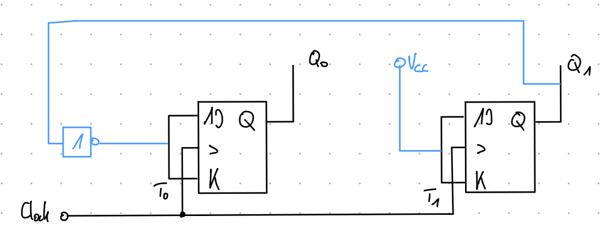

# 2-Bit Synchronous Counter

A hardware 2-bit synchronous binary counter built from discrete flip-flop logic (74LS-series ICs) on a breadboard, clocked and read out by an Arduino Uno, with the resulting count (0–3) shown live on a 7-segment display.

I covered the theory in my digital electronics class during my computer engineering studies and wanted to build a project around it because I thought the topic was pretty cool.

See [Video Demonstration](#video-demonstration) for how it works.

## How it works

- The Arduino generates a clock pulse (pin 13) that drives both flip-flops' clock inputs **at the same time**. This shared clock is what makes it a *synchronous* counter, as opposed to a ripple/asynchronous counter where each flip-flop clocks the next one individually.
- The two flip-flop outputs (Q0, Q1) are wired back into two Arduino input pins (11 and 12), giving a 2-bit binary value from 0 to 3.
- Every cycle, the Arduino reads Q0/Q1, combines them into a decimal number, and drives the correct segment pattern on a 7-segment display so the count is human-readable.

## Logic design

The counter uses two JK flip-flops. The state table below shows, for each count value, what the toggle inputs T1/T0 need to be to advance to the next state:

| Decimal | Q1 | Q0 | T1 | T0 |
|:-------:|:--:|:--:|:--:|:--:|
|    3    |  1 |  1 |  1 |  0 |
|    1    |  0 |  1 |  1 |  1 |
|    2    |  1 |  0 |  1 |  0 |
|    0    |  0 |  0 |  1 |  1 |

From this table, the toggle logic simplifies to:

- **T1 = 1** - the high-bit flip-flop always toggles on every clock pulse.
- **T0 = Q1'** - the low-bit flip-flop only toggles when Q1 is low.

### Schematic

## Breadboard

## Video Demonstration